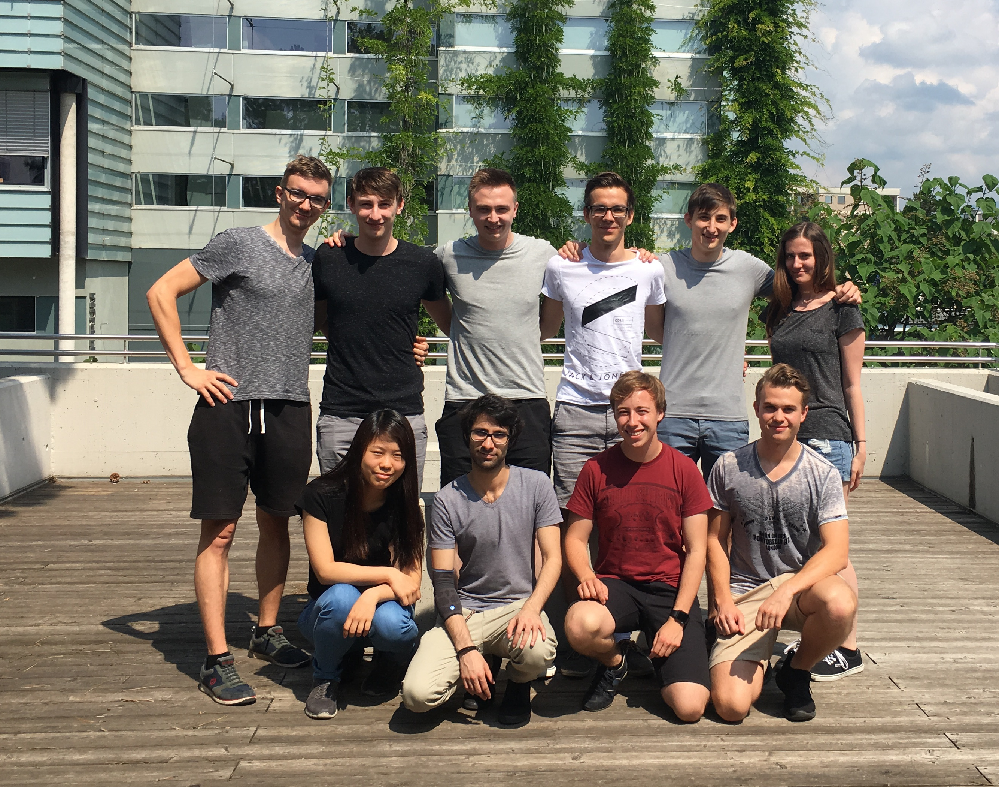

# Tube Mobile

## Installation

- You have to be connected to the Internet
- You have to be inside the TU-Graz-Network, either through eduroam or via VPN
- The tube-test-server has to be up and running
- minimum Android Version 8.0

## Tests

### Structure

- Tests location `app/TUbe/src/androidTest`
  - UI Tests  `app/TUbe/src/androidTest/java/com/group/tube`
  - Unit Tests `app/TUbe/src/androidTest/java/unitTests`
  - Mocking classes `app/TUbe/src/androidTest/java/android`

### Test Tube State

- We expect the test tube data to be in a correct state so all our tests work
  - at least 3 courses are returned
  - all courses return at least one episode
  - the course "INH.02007UF 18S Softwareentwicklung Praktikum" with the ID `b69911cc-9c04-4e21-9053-93c068283d5f` exists at all times
  - the episode "#4" with the ID `dbd281f3-6072-4e34-bb3a-3a124b37fa83` of the course INH.02007UF 18S Softwareentwicklung Praktikum exists at all times

### Executing Tests

- If during test execution a pop up opens asking you to choose a browser, please do so and set it as default browser. 

- If chrome asks you to steal your data, please click on "Accept & Continue".

#### Testing Code Coverage

1. In the project tree view, choose "Project" 
2. Right Click on the folder `java` under `app -> TUbe -> src -> androidTest -> java`

## Collaborators

| Who? | Github?     |
| ------- | ---- |
| Felix | [@SgtMushroom](https://github.com/SgtMushroom) |
| Mitja | [@realitystruck](https://github.com/realitystruck) |
| Max | [@MaxWeb22](https://github.com/MaxWeb22) |
| Florian L | [@FlorianLes](https://github.com/FlorianLes) |
| Florian B | [@flob2506](https://github.com/flob2506) |
| Julia | [@juulez](https://github.com/juulez) |
| Chu | [@cychu5](https://github.com/cychu5) |
| Dany | [@Danym93](https://github.com/Danym93) |
| Patrick | [@deutschmn](https://github.com/deutschmn) |
| Paul | [@Elektropepi](https://github.com/Elektropepi) |